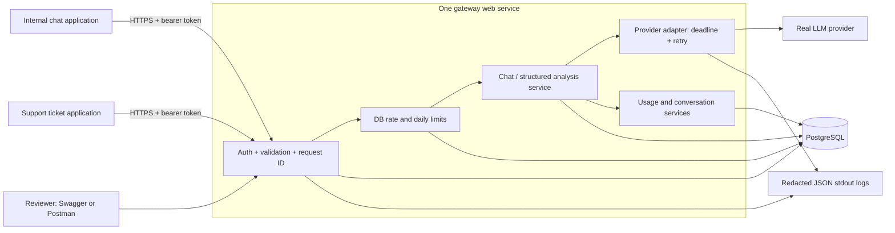

# Architecture and reliability design

**Mixed status:** Phase01–03 implement the API foundation, database setup, and authentication. The chat/provider/retry/persistence sequence and reliability parameters below remain design until their phases are implemented and verified. Update diagrams to match each accepted phase before submission.

## System boundary



Clients hold gateway tokens. Provider API keys stay in server secret configuration. Database is the source of truth for conversation/usage; logs support tracing without duplicating prompt content.

## Successful request sequence

```mermaid
sequenceDiagram
  participant C as Client
  participant G as Gateway
  participant D as PostgreSQL
  participant P as Provider
  C->>G: POST /v1/ai/chat + JWT
  G->>G: Authenticate, validate, allocate request_id
  G->>D: Verify owner; insert pending request; reserve quotas
  G->>D: Claim conversation if chat; commit short transaction
  G->>D: Insert provider_attempt started
  G->>P: Model + trusted prompt + bounded context
  P-->>G: Output, model, provider ID, usage
  G->>G: Validate response or structured output
  G->>D: Finalize attempt + request + successful messages atomically
  D-->>G: Commit confirmed
  G-->>C: 200 + request_id + result + known usage
```

No transaction/row lock spans the LLM network wait. Reserve quotas before upstream calls. For chat, acquire a logical in-flight claim in a short transaction; a second request for the same conversation returns 409. A new conversation created for a failed request can remain empty; it is not represented as a successful turn.

## Input and context

- Auth/login JSON, not an OAuth2 authorization server. HTTP bearer scheme in Swagger; JWT sub is the internal UUID.
- JWT uses a generated strong secret, explicit algorithm allowlist, `sub`, `iat`, `exp`, `iss`, `aud`; expiry target 60 minutes. Load active user from DB.
- Query all user-owned resources using user_id; resource outside ownership returns 404. A UUID is not an access-control mechanism.
- Chat receives a single `message`, optional `conversation_id`, and allowlisted `route=standard`; reject client `user_id`, `system`, arbitrary model/base URL and unknown fields.
- Chat input max 4,000 characters; analyze max 8,000; HTTP body max 64 KiB. Context contains at most the newest 20 saved messages, dropping oldest complete turns to stay below a 40,000-character input budget. New input always retained. Output caps begin at 512 chat/1,024 analyze tokens and are verified against the chosen model.
- Only successful saved turns enter subsequent context. Analyze is stateless and stores its validated result in the request ledger.
- Ticket text is untrusted data. Fixed server instruction forbids following embedded instructions. No tools, external retrieval or execution. Schema validation verifies structure, not factual accuracy; human checks still matter.

## Structured output

Use provider-supported schema output, then application validation. Ticket v1 fields: `summary`, `category`, `priority`, `sentiment`, `requires_human`, `suggested_reply`. Allowed enums and limits are in the OpenAPI contract. Provider-facing JSON Schema uses its supported subset; application checks extra length/business limits after parsing. Do not require schema keywords a model does not support without smoke testing.

Refusal is a separate terminal result (HTTP 422 `MODEL_REFUSAL`); incomplete output or failed schema validation is an upstream failure (502), not a fabricated success. Preserve available token metadata even when output is rejected. No JSON “repair” that silently changes meaning in P0.

OpenAI provides structured parsing helpers and separately documents refusals: [Structured Outputs](https://developers.openai.com/api/docs/guides/structured-outputs). This design does not promise zero hallucinations or support for every model.

## Time budget and retries

Parameters are initial targets, not measured latency claims:

| Parameter | Starting value |
|---|---:|
| Entire HTTP request budget | 30 seconds |
| Maximum LLM phase including retry waits | 27 seconds, also bounded by remaining HTTP budget |
| Per-attempt ceiling | 10 seconds, capped by remaining deadline |
| Connect timeout | 3 seconds or remaining budget, whichever smaller |
| Total upstream attempts | 3 including initial call and any fallback |
| DB finalization reserve | Up to 3 seconds within overall budget |
| Backoff without Retry-After | Exponential 0.5, 1.0 seconds + small random jitter |

Measure elapsed duration using monotonic time; persist UTC timestamps. Allocate a deadline once. Use asynchronous cancellation and cap every wait/call by remaining time. Database statement/pool waits also need bounds. If insufficient time remains, stop; do not start a last attempt that cannot fit. Test the outer request deadline independently from HTTP transport timeouts.

The gateway owns the retry loop; configure provider SDK `max_retries=0`. Retry temporary 429/408/5xx only after inspecting provider error details; connection failures retry only when no bytes were sent or safety is otherwise established. Respect valid Retry-After, including HTTP date; if it exceeds the remaining budget, return 503 rather than retry early. Never retry authentication, malformed requests, unsupported models, exhausted quota/billing, refusals or invalid schema.

Do not automatically replay an ambiguous read-timeout after a request may have reached the provider. Finalize timeout with unknown usage where necessary; the provider may still complete and charge it. An explicit transient 503→success test demonstrates the retry requirement without claiming exactly-once upstream execution.

These decisions follow the official guidance to bound total retries, account for SDK retries and distinguish quota errors: [Rate limits](https://developers.openai.com/api/docs/guides/rate-limits), [Error codes](https://developers.openai.com/api/docs/guides/error-codes). Actual retryable exception types must be checked against the SDK version installed.

## Persistence and failure recovery

1. After authentication, input validation and ownership checks, insert a pending AI request. Rejections before that boundary get a redacted request log; unauthenticated requests cannot truthfully have a user/model record.
2. Rate limit rejection finalizes that row as `rate_limited`, with zero upstream attempts and known zero tokens. Quota reservations are not refunded by downstream failure: these are attempted-operation caps.
3. Atomically claim a conversation by assigning its `in_flight_request_id` if empty. On conflict, record failed `CONVERSATION_BUSY` with zero attempts and return 409.
4. Insert and commit each attempt before provider dispatch. Persist metadata as soon as available. A failed attempt can have known billed tokens or unknown usage.
5. At success, use one transaction for terminal request, attempt status, user+assistant messages and release claim. Respond 200 only after commit. Sequence allocation is protected by a brief conversation-row lock.
6. On handled failure, finalize status and release claim; failed turns are not appended to conversational history. Use a small bounded cleanup window on cancellation.
7. At startup reconcile stale pending requests older than a safe threshold (target 2× maximum request budget): mark cancelled/`PROCESS_INTERRUPTED`, terminalize any still-started attempts with bounded elapsed time and unknown usage, keep tokens incomplete, release claims. Never resend them to the provider automatically. Run reconciliation in a DB-locked transaction so replicas do not race.
8. If DB fails after provider success, return 503 `PERSISTENCE_ERROR`, log request/provider IDs and the persistence failure. Do not return an unsaved “success” or silently call provider again. Metadata may remain incomplete if it could not be saved; README discloses this limitation.

## Rate limit and demo budget

DB fixed-window counters with atomic upsert, common to all workers. Initial per-user AI limit: 10/minute. Daily user/global caps are required config and are finalized with budget/reviewer access; `.env.example` provides conservative starting values, not a promised capacity. Failed admitted requests consume quota. Login has a separate 5/minute counter keyed by a privacy-preserving hash of trusted client IP.

On rejection: 429, `RATE_LIMITED` or `DAILY_QUOTA_EXCEEDED`, `Retry-After` seconds until reset; no provider call. Do not trust arbitrary X-Forwarded-For: configure known host proxy rules. Minute windows permit bursts across their boundary; document fixed-window semantics. SQL in DATABASE.md gives the concurrency primitive.

## Logging and operational safety

Log JSON events `request_started`, `provider_attempt_finished`, `request_finished`; include request_id, user UUID if known, route/operation, provider, model, status, latency and sanitized error_code. Provider request IDs are correlation data. Redact Authorization, passwords, provider keys, DB URLs; do not log raw prompt/response bodies. Avoid SDK/HTTP debug logs in deploy.

HTTPS on host; env secret validation at startup; disabled public signup; CORS denied unless an explicit client origin needs it. Liveness checks process; readiness checks DB without paid provider calls. Do not claim the application has been load-tested or is production-ready. Planned limitations include JWT revocation/refresh, full billing reconciliation, deletion/retention automation, fixed-window limiter, shared demo account and exactly-once delivery.

If P1 fallback is added, route/model are selected from server allowlists and each attempt stores its actual model. Failed fallback candidates never get called success; cost/usage reflects all known attempts.
