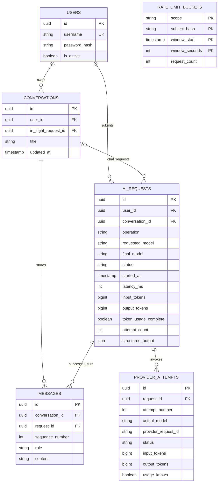

# Database design and metrics

PostgreSQL, with Supabase selected during Phase01. [schema.sql](../db/schema.sql) is a design baseline, not a migration that has run. Tables are planned in internal schema `gateway`, kept outside Supabase exposed Data API schemas; Phase02 must verify grants/RLS and deny anon/authenticated direct access. Implement equivalent models and Alembic migrations, then verify the real database. UUIDs are generated in the application; all persisted timestamps are UTC (`timestamptz`). No prompt or password plaintext belongs in operational logs. See [Supabase security guidance](https://supabase.com/docs/guides/api/securing-your-api).

## Entity relationships



`rate_limit_buckets` also supports login-IP and gateway-wide counters; it is intentionally not a foreign-key relationship to users. This design has **six tables**, including operational attempt/counter tables.

## Data invariants

- Request id is the HTTP response/log `request_id`; provider IDs are separate values.
- Owner cannot change. Composite foreign keys ensure a chat request/message cannot attach to another user's conversation.
- Analyze has no conversation; output lives in `ai_requests.structured_output` with `schema_version=1`.
- User/assistant messages are inserted together only after successful completion, with unique `(request_id, role)` and `(conversation_id, sequence_number)`.
- One logical chat is claimed per conversation while awaiting a provider. Claim uses a committed conditional update, not a transaction held across network I/O. Release with terminal update; stale claims are reconciled after process interruption.
- `ai_requests.attempt_count` and token summaries are calculated from attempts at finalization in the same transaction. They are denormalized summaries, not an independent billing source.
- If a request has no provider dispatch, its token values are known 0. If any dispatched attempt lacks complete metadata, `token_usage_complete=false`; never infer unreported tokens from character counts.
- Summary tokens add all known input/output metadata across attempts, including an attempt whose output failed validation. If nothing is known after a dispatch, summary values are null. Partial sums are labeled partial by the completeness flag.
- Actual/final model remains null if no model identity is known. Requested model is present from server config even on local rejection.
- No cascading user deletion in P0; deletion and retention require an explicit future policy, especially with the conversation claim foreign key.

## Usage window and definitions

`GET /v1/usage` is scoped to the authenticated user. Query window is `[from, to)` on request **started_at**, using ISO 8601 with explicit timezone. Default: previous 24 hours. Maximum: 31 days. Convert to UTC; reject `from >= to`. A request started before the window but completed inside it is outside this cohort; document that choice.

Only terminal requests participate in completed aggregates. Pending requests are reported separately. Formulas:

| Field | Definition |
|---|---|
| `requests` | All terminal authenticated, valid, owned AI requests in the window |
| `admitted_requests` | Terminal requests excluding `rate_limited` |
| `successful_requests` | `status=succeeded` |
| `failed_requests` | `status IN (failed, timeout, cancelled)` |
| `refused_requests` | `status=refused` |
| `rate_limited_requests` | `status=rate_limited`, zero upstream calls |
| `pending_requests` | `status=pending`; excluded from terminal metrics |
| `average_latency_ms` | Average gateway monotonic latency over admitted terminal requests, including retry/backoff and persistence |
| `error_rate` | `failed_requests / admitted_requests`; refusal and local rate limiting are not counted as operational errors |
| `input_tokens`, `output_tokens`, `tokens` | Sum known metadata over all provider attempts of terminal requests; total = input + output |
| `token_usage_complete` | True only if every terminal request in cohort has complete metadata (empty cohort true) |
| `partial_usage_requests` | Terminal requests with incomplete metadata |
| `provider_attempts` | Number of attempts linked to terminal requests |
| `retry_attempts` | Sum of `max(attempt_count - 1, 0)` over terminal requests |

Zero admitted requests: `average_latency_ms=null`, `error_rate=null` (undefined, rather than pretending reliability is perfect). Token sum of an empty/unknown cohort can be 0 **known tokens**, with completeness conveying whether the total is unknown. `error_rate` is a fraction (0.5 means 50%), not an already-percent value. Round presentation to two decimals for latency and four for error rate; do not round source data.

Validation/auth/ownership failures before request admission are request logs, not provider usage rows. Usage does not claim to count every HTTP request to the service. Concurrency-busy requests after admission are failed with zero attempts.

## Aggregate SQL baseline

Parameterized by UUID and UTC timestamps; never interpolate user input into SQL. Aggregate request and attempt sets independently to avoid multiplying rows by joins to messages.

```sql
WITH cohort AS (
  SELECT * FROM gateway.ai_requests
  WHERE user_id = :user_id AND started_at >= :from_utc AND started_at < :to_utc
), terminal AS (
  SELECT * FROM cohort WHERE status <> 'pending'
), request_metrics AS (
  SELECT
    count(*) AS requests,
    count(*) FILTER (WHERE status <> 'rate_limited') AS admitted_requests,
    count(*) FILTER (WHERE status = 'succeeded') AS successful_requests,
    count(*) FILTER (WHERE status IN ('failed','timeout','cancelled')) AS failed_requests,
    count(*) FILTER (WHERE status = 'refused') AS refused_requests,
    count(*) FILTER (WHERE status = 'rate_limited') AS rate_limited_requests,
    avg(latency_ms) FILTER (WHERE status <> 'rate_limited') AS average_latency_ms,
    (count(*) FILTER (WHERE status IN ('failed','timeout','cancelled')))::numeric
      / nullif(count(*) FILTER (WHERE status <> 'rate_limited'), 0) AS error_rate,
    count(*) FILTER (WHERE NOT token_usage_complete) AS partial_usage_requests,
    coalesce(bool_and(token_usage_complete), true) AS token_usage_complete,
    coalesce(sum(greatest(attempt_count - 1, 0)), 0) AS retry_attempts
  FROM terminal
), attempt_metrics AS (
  SELECT count(*) AS provider_attempts,
    coalesce(sum(a.input_tokens), 0) AS input_tokens,
    coalesce(sum(a.output_tokens), 0) AS output_tokens
  FROM gateway.provider_attempts a JOIN terminal t ON t.id = a.request_id
)
SELECT r.*, a.*, a.input_tokens + a.output_tokens AS tokens,
  (SELECT count(*) FROM cohort WHERE status = 'pending') AS pending_requests
FROM request_metrics r CROSS JOIN attempt_metrics a;
```

For P1 breakdown by model, aggregate attempts by `(provider, coalesce(actual_model, requested_model))`, and label fallback identities correctly. Do not group all retry usage under the final model. For cost estimates, use a dated price table and disclose unknown token/price entries; never claim this is the provider invoice.

## Verification fixture with exact expected result

All rows belong to one user in one query window. These are **synthetic test data**, not observed product metrics.

| Request | Final status | Latency ms | Attempts and known tokens |
|---|---|---:|---|
| A | succeeded | 1000 | 1 success: input 100, output 20 |
| B | succeeded | 2000 | 1 failed 503 with unknown usage, then success: input 200, output 40 |
| C | failed (schema) | 500 | 1 response with invalid output: input 50, output 10 |
| D | timeout | 3000 | 1 dispatch with unknown usage |
| E | rate_limited | 10 | 0 attempts: known 0 tokens |

Expected: `requests=5`, `admitted_requests=4`, `successful_requests=2`, `failed_requests=2`, `rate_limited_requests=1`, `refused_requests=0`, `average_latency_ms=1625`, `error_rate=0.5`, `input_tokens=350`, `output_tokens=70`, `tokens=420`, `provider_attempts=5`, `retry_attempts=1`, `partial_usage_requests=2`, `token_usage_complete=false`, `pending_requests=0`.

## Atomic limiter primitive

Use a short transaction, parameterized values, and `limit >= 1`. Window start is derived from trusted server UTC time (minute/day boundaries). A returned row reserves one slot; no returned row means quota exhausted. For an admitted AI request, reserve user-minute, user-day and global-day buckets in a consistent order in the same transaction; if any fails, rollback all reservations. The pending ledger row is committed separately before quota reservation, so its rejection can still be finalized.

```sql
INSERT INTO gateway.rate_limit_buckets
  (scope, subject_hash, window_start, window_seconds, request_count)
VALUES (:scope, :subject_hash, :window_start, :window_seconds, 1)
ON CONFLICT (scope, subject_hash, window_start, window_seconds)
DO UPDATE SET request_count = rate_limit_buckets.request_count + 1
WHERE rate_limit_buckets.request_count < :limit
RETURNING request_count;
```

Keep quota reservations after provider failure to bound attempted operations. Expired bucket cleanup can occur at startup or a bounded maintenance step, not full-table cleanup on every request. Bound statement/lock waits. Limit and daily cap are operation counts, not exact dollar spend: actual provider charges can include ambiguous timeouts/retries.
